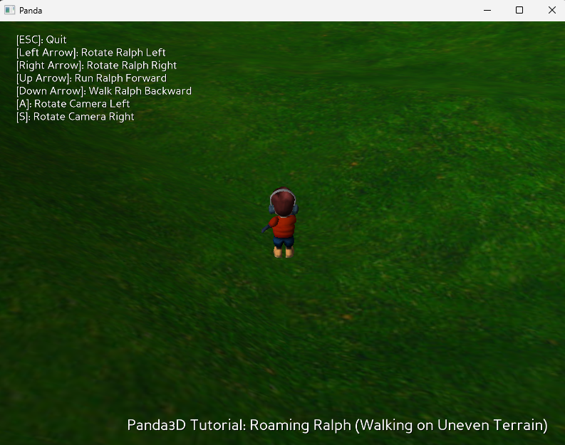
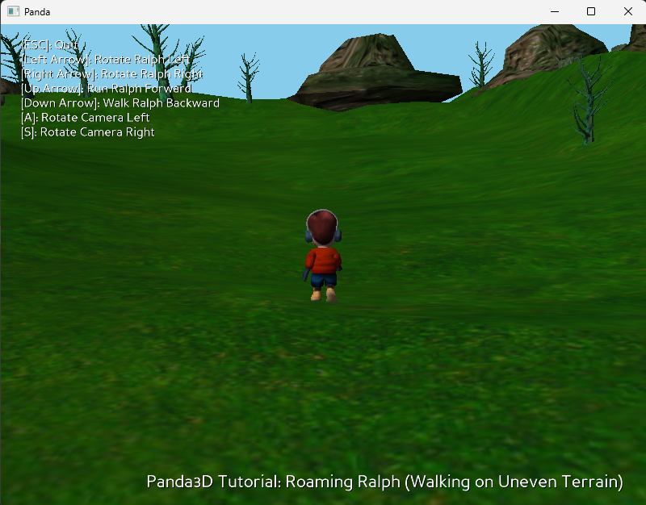
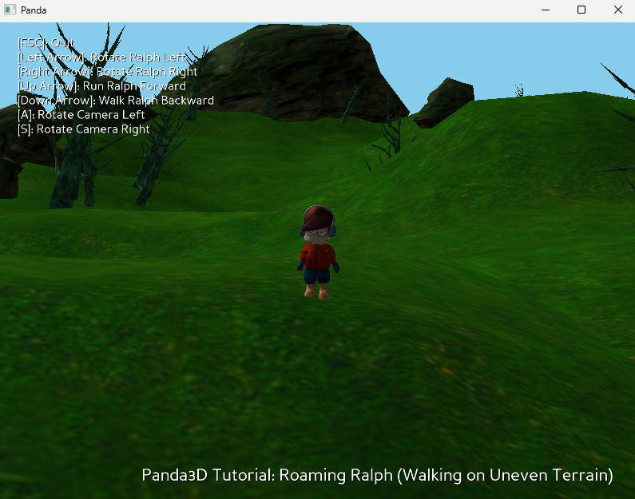

# Roaming Ralph – Panda3D Demo

A simple third-person character controller demo built with **Panda3D**.

This project showcases:

* Character movement and animation blending
* Collision detection with uneven terrain
* Terrain height adjustment using collision rays
* A fully rotatable third-person camera
* Cross-platform packaging with `build_apps`

Based on the classic **“Roaming Ralph”** tutorial.

---

## 📸 Screenshots





---

## 🎮 Controls

| Key   | Action              |
| ----- | ------------------- |
| `ESC` | Quit                |
| `←`   | Rotate Ralph left   |
| `→`   | Rotate Ralph right  |
| `↑`   | Run forward         |
| `↓`   | Walk backward       |
| `A`   | Rotate camera left  |
| `S`   | Rotate camera right |

---

## 🧠 Features Explained

### Character Movement

* Uses `Actor` for animation (`run` and `walk`)
* Animation state changes automatically depending on movement input
* Backward walking plays the walk animation in reverse

### Collision System

* Collision spheres prevent the character from walking through objects
* A `CollisionHandlerPusher` handles physical pushback
* Downward collision rays:

  * Keep Ralph aligned to terrain height
  * Keep the camera above ground level

### Camera System

* Third-person follow camera
* Maintains:

  * Minimum distance (5 units)
  * Maximum distance (10 units)
* Always looks at a floating node above Ralph’s head for stable tracking

---

## 📦 Project Structure

```
Ralph/
│
├── main.py
├── setup.py
├── requirements.txt
├── models/
│   ├── ralph.egg
│   ├── ralph-run.egg
│   ├── ralph-walk.egg
│   └── world.egg
│
├── screenshots/
└── build/   (generated)
```

---

## ⚙️ Requirements

* Python 3.13+
* Panda3D 1.10.16

Install dependencies:

```bash
pip install -r requirements.txt
```

---

## ▶️ Running the Game

From the project root:

```bash
py main.py
```

If everything loads correctly, you should see:

```
Known pipe types:
  wglGraphicsPipe
(all display modules loaded.)
```

---

## 🏗️ Building Standalone Executables

This project uses Panda3D’s `build_apps` system.

Build for all supported platforms:

```bash
python setup.py build_apps
```

Platforms built:

* manylinux2014_x86_64
* macOS (10.13+)
* Windows (win_amd64)

Output is generated in:

```
build/
```

### macOS

Creates:

```
build/macosx_10_13_x86_64/Ralph.app
```

### Windows

Creates a runnable directory inside:

```
build/win_amd64/
```

---

## ⚠️ Build Warnings

You may see warnings such as:

* Missing `_posixsubprocess`
* Missing `_bootlocale`
* Missing `libcrypto.so.3`
* Missing `libmpdec.so.4`

These are common when building cross-platform bundles and typically **do not prevent the game from running**.

---

## 💡 How It Works (High-Level)

1. `ShowBase` initializes the engine.
2. The world model (`models/world`) is loaded with embedded collision meshes.
3. Ralph is loaded as an `Actor` with animations.
4. Collision spheres protect Ralph from obstacles.
5. Downward collision rays determine terrain height.
6. A task (`moveTask`) updates:

   * Movement
   * Animations
   * Camera positioning
   * Terrain alignment

---

## 📚 Learning Goals

This project demonstrates:

* Basic 3D character controllers
* Working with collision masks
* Terrain-following mechanics
* Third-person camera logic
* Packaging Panda3D games

---

## 👤 Credits

* Author: Ryan Myers
* Models: Jeff Styers, Reagan Heller
* Engine: Panda3D

---

## 📜 License

This project is intended for educational purposes.
Refer to Panda3D’s license for engine-specific terms.
